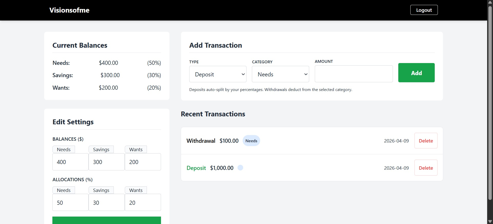

# Finance Automation Suite

This repository contains a professional-grade, high-concurrency end-to-end automation suite for the **Visionsofme** financial application. Re-engineered for high performance, the system utilizes a **.NET 10.0** backend with **PostgreSQL**, while the testing suite is powered by **Playwright** and **TypeScript** to handle complex state management and multi-user isolation.

---



## Key Features

* **Multi-Tenant Worker Isolation**: Implements a custom worker-scoped architecture that maps each Playwright worker to a unique test account (`demo1`–`demo4`). This eliminates race conditions during parallel execution.
* **On-Demand Authentication**: Features a "lazy-loading" authentication strategy where workers generate and reuse session storage states (`.json`) only when needed.
* **EF Core State Management**: Utilizes **Entity Framework Core 10** to manage database state. The suite leverages a dedicated reset utility to clear PostgreSQL records in milliseconds, ensuring a "Clean Slate" for every test.
* **Containerized Orchestration**: Fully Dockerized environment using **Docker Compose** to manage the .NET application, a PostgreSQL 15 database, and the Playwright test runner in a unified virtual network.
* **Robust UI Formatting**: Features custom balance rendering logic that handles negative values using standard mathematical notation (`-50.00`) while maintaining professional currency formatting for transaction history.

---

## Tech Stack

* **Framework**: [Playwright](https://playwright.dev/)
* **Language**: TypeScript & C#
* **Backend**: ASP.NET Core 10
* **Database**: PostgreSQL 15 (via Npgsql)
* **ORM**: Entity Framework Core 10

---

## Test Coverage

### Transactions
Validates the core financial engine, including:
* **Standard Persistence**: Full validation of deposits and withdrawals using PostgreSQL.
* **Bounds Testing**: Edge-case handling for large amounts ($999,999,999.99).
* **Input Validation**: Logic to prevent non-positive transaction amounts.
* **State Verification**: Real-time balance updates and verification of the most recent entry.
* **Data Integrity:** Comprehensive testing of transaction deletion to ensure account balances correctly roll back to their previous states.

### Balances
Ensures the reliability of direct balance adjustments:

* **Boundary Validation**: Verification that users can update balances to specific positive values, zero, or leave them blank (defaulting to the current value).
* **Negative Constraints**: Strict enforcement of business rules preventing manual updates to negative values via the UI.

### Allocations
Ensures the budget distribution logic remains precise:
* **Precision**: Updating percentages to specific decimal values (e.g., 0.01%).
* **Business Rules**: Strict enforcement of the "Must add up to 100%" rule.
* **Integrity**: Bounds checking to prevent negative values or totals exceeding 100%.

### Authentication
Comprehensive security flow testing:
* **Session Management**: Successful login and session persistence across tests.
* **Validation**: Error handling for incorrect passwords and existing usernames.
* **Security**: Database-level verification of hashed credentials using BCrypt.

---

## Configuration & Parallelism

The suite is optimized for high-performance hardware, utilizing the logical processors of modern CPUs.

* **Parallel Workers**: Configured to run 4 simultaneous workers by default to match the test account pool.
* **Network Binding**: The .NET application is configured to listen on `0.0.0.0:8080` within Docker to facilitate cross-container communication with the Playwright runner.

---

## Project Structure

```text
Fintech_Automation_Suite/
├── Automation_Suite/            # Playwright Testing Framework
│   ├── fixtures/
│   │   └── pom-fixtures.ts      # Multi-tenant worker logic & custom fixtures
│   ├── pages/                   # Page Object Models (POM)
│   │   ├── BasePage.ts          # Parent class for shared navigation
│   │   ├── HomePage.ts          # Dashboard, transactions, and settings logic
│   │   ├── LoginPage.ts         # Authentication selectors and methods
│   │   └── SignupPage.ts         # User registration interaction
│   ├── tests/                   # End-to-End Test Suites
│   │   ├── allocation.test.ts   # Budget distribution & percent logic
│   │   ├── auth.test.ts         # Login/Signup security flows
|   |   ├── balances.test.ts     # Direct balance update & boundary validation
│   │   ├── delete-tx.test.ts    # Transaction removal & balance roll-back logic
│   │   └── tx.test.ts           # Core deposit and withdrawal engine
│   └── playwright.config.ts     # Test runner & BASE_URL orchestration
│
├── Visionsofme/                 # .NET 10.0 Backend (System Under Test)
│   ├── Models/                  # C# Entity models (User, Transaction)
│   ├── Views/                   # Razor Pages (Source of UI locators)
│   ├── Data/                    # DbContext & PostgreSQL configuration
│   ├── Program.cs               # App entry point & Database Seeding
│   └── Visionsofme.csproj       # .NET Project file & NuGet dependencies
│
├── Dockerfile                   # Single-stage SDK & Node.js build
├── docker-compose.yml           # App, DB (Postgres), and Tester services
├── package.json                 # Node.js dependencies (Playwright v1.59.1)
└── package-lock.json            # Deterministic dependency lock file
